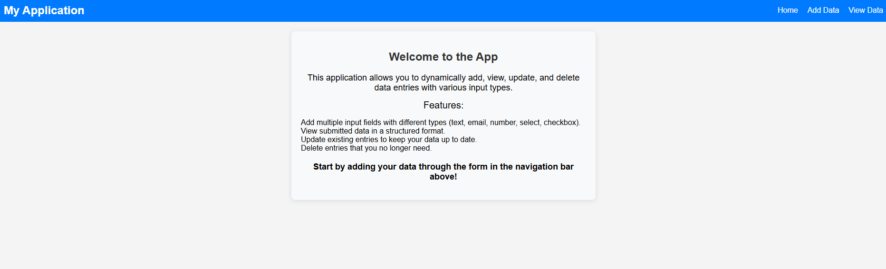
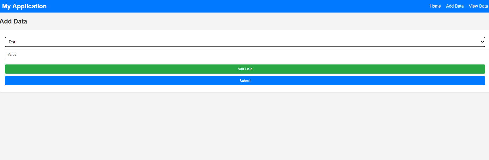
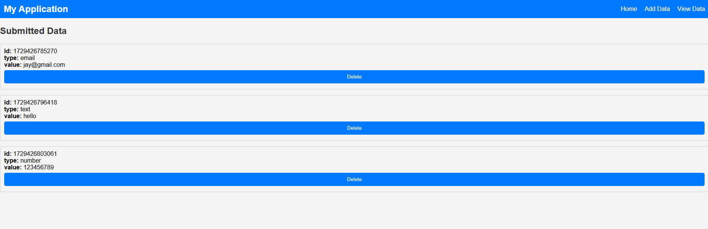

To include a section for images in your README file, you can add a "Screenshots" section that showcases the application's user interface or key features. Here's how you can integrate that into the existing README structure:

````markdown
# Dynamic Data Management App

## Description

The Dynamic Data Management App allows users to dynamically add, view, update, and delete various data entries with multiple input types (text, email, number, select, checkbox). This application is built with React and provides a user-friendly interface for managing data effectively.

## Features

- **Dynamic Input Fields**: Users can add multiple input fields with different types based on their needs.
- **Validation**: Input fields are validated to ensure data integrity, including checks for empty fields and valid email formats.
- **View Submitted Data**: Users can view all submitted data in a structured format, making it easy to track entries.
- **Update and Delete**: Users have the ability to update existing entries and delete those they no longer need.
- **Responsive Design**: The app is styled for a better user experience across various devices.

## Screenshots

Here are some screenshots showcasing the app's functionality:

### 1. Home Page



### 2. Add Data Page



### 3. View Data Page



## Installation

To run this application locally, follow these steps:

1. **Clone the repository**:
   ```bash
   git clone https://github.com/yourusername/dynamic-data-management-app.git
   ```
````

2. **Navigate to the project directory**:
   ```bash
   cd dynamic-data-management-app
   ```
3. **Install dependencies**:
   ```bash
   npm install
   ```

## Usage

1. Start the application:
   ```bash
   npm start
   ```
2. Open your browser and navigate to `http://localhost:3000`.
3. Use the navigation bar to access different features of the app:
   - **Home**: Introduction to the app.
   - **Add Data**: Add new data entries with various input types.
   - **View Data**: View all submitted data and manage entries.

## Acknowledgments

- This project was inspired by the need for a dynamic form management solution.
- Special thanks to the React community for their invaluable resources and support.
